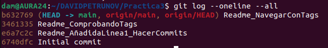
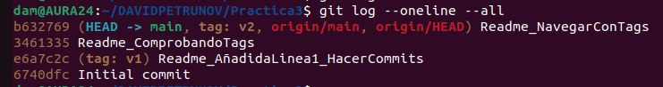
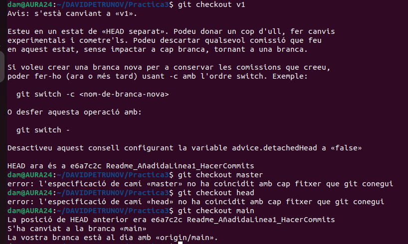
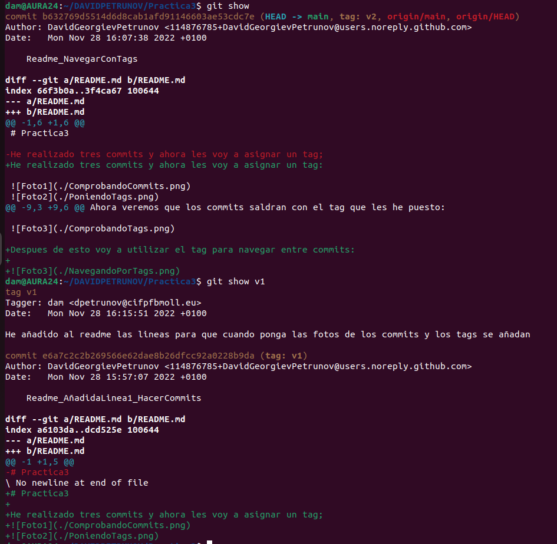
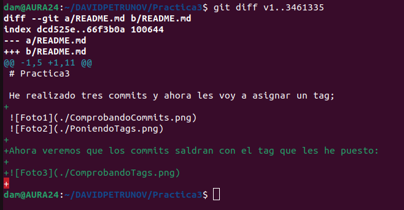
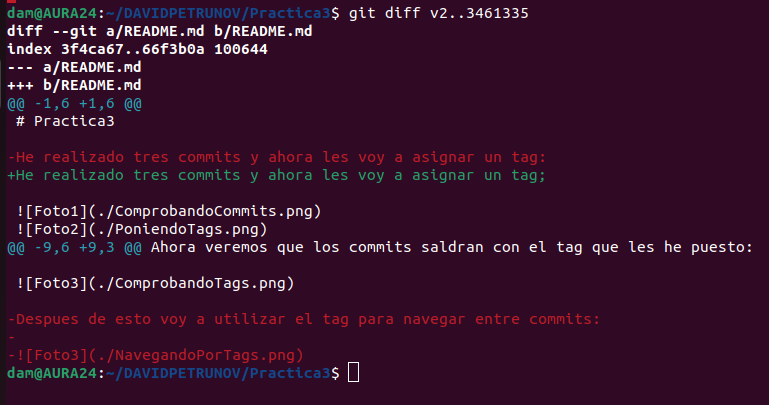
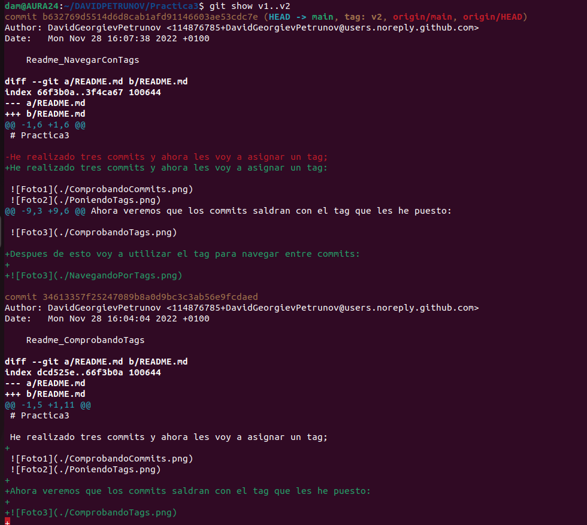

# Practica3

He realizado tres commits y ahora les voy a asignar un tag:

Ahora veremos que los commits saldran con el tag que les he puesto:

Despues de esto voy a utilizar el tag para navegar entre commits:

Podemos usar el show para ver el contenido de un commit determinado, en este caso del commit en el que estamos:

Tambien podemos usasr el diff para ver las diferencias entre dos commits;

Finalmente podemos ver que el show se puede hacer con dos commits en lugar de solo uno, la diferencia entre esto y hacer un diff es que el diff señala lo que añade o quita el primero respecto al segundo mientras que el show muestra los dos y lo que se ha añadido o quitado.

